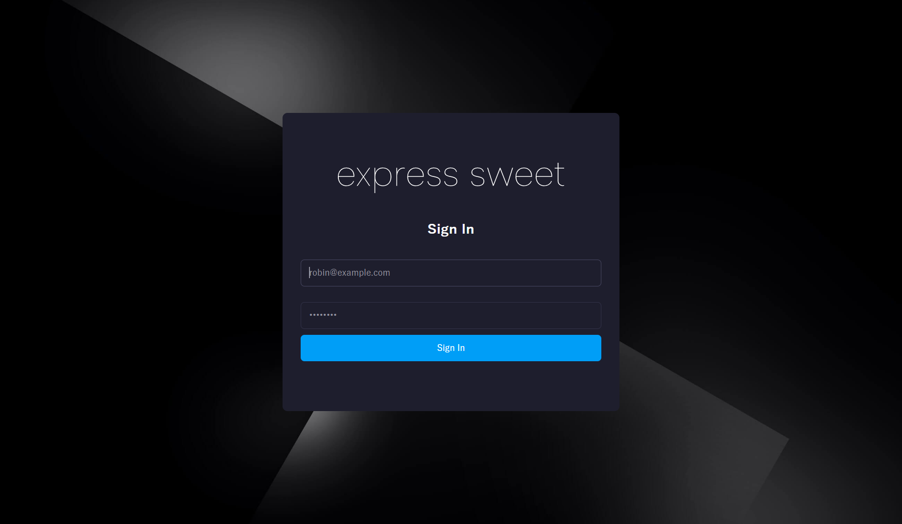
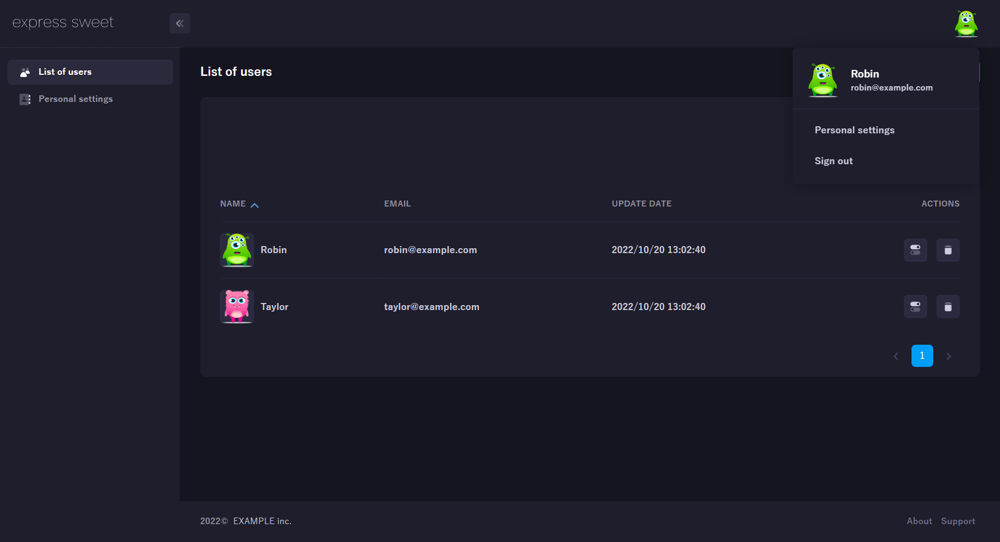
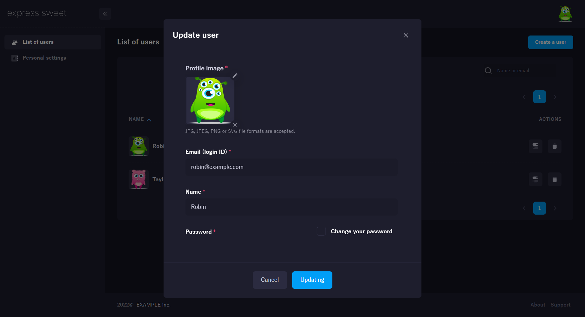

[](https://takuya-motoshima.github.io/express-sweet/v1/install.html)

Express framework extension.

## Documentation
* [Express Sweet Documentation](https://takuya-motoshima.github.io/express-sweet/v1/)
* [Changelog](CHANGELOG.md)

## Quick Start
The easiest way to get started with Express Sweet is to install express-sweet-generator and automatically create a template application.  
The following application can be started immediately by executing the template.  
See <a href="https://takuya-motoshima.github.io/express-sweet/v1/" target="_blank">here</a> for instructions on using express-sweet.

<p align="center">
  
  
</p>
<p align="center">
  
  
</p>

1. Use the application generator tool, express-sweet-generator, to quickly create an application skeleton.  
    ```sh
    npm install -g express-sweet-generator
    ```

1. Create an Express myapp named myapp.  
    The app is created in a folder named myapp in the working directory.
    ```sh
    express-sweet myapp
    # If you want to use ESM, below.
    #express-sweet -o esm myapp
    ```
1. Install dependent packages.
    ```sh
    cd myapp
    npm install
    ```
1. This sample application uses a database.
    Execute the following SQL to create the database.
    ```sql
    CREATE DATABASE IF NOT EXISTS `sampledb` DEFAULT CHARACTER SET utf8mb4;

    USE `sampledb`;

    CREATE TABLE `user` (
      `id` int(10) unsigned NOT NULL AUTO_INCREMENT,
      `name` varchar(30) NOT NULL,
      `email` varchar(255) NOT NULL,
      `password` varchar(100) NOT NULL,
      `icon` varchar(768) NOT NULL DEFAULT MD5(RAND()),
      `created` datetime NOT NULL DEFAULT current_timestamp(),
      `modified` datetime NOT NULL DEFAULT current_timestamp() ON UPDATE current_timestamp(),
      PRIMARY KEY (`id`),
      UNIQUE KEY `ukUserEmail` (`email`),
      UNIQUE KEY `ukUserIcon`(`icon`)
    ) ENGINE=InnoDB DEFAULT CHARSET=utf8mb4;

    CREATE TABLE `profile` (
      `id` int(10) unsigned NOT NULL AUTO_INCREMENT,
      `userId` int(10) unsigned NOT NULL,
      `address` varchar(255) NOT NULL,
      `tel` varchar(14) NOT NULL,
      `created` datetime NOT NULL DEFAULT current_timestamp(),
      `modified` datetime NOT NULL DEFAULT current_timestamp() ON UPDATE current_timestamp(),
      PRIMARY KEY (`id`),
      UNIQUE KEY `ukProfileUserId` (`userId`),
      CONSTRAINT `fkProfileUser` FOREIGN KEY (`userId`) REFERENCES `user` (`id`)
    ) ENGINE=InnoDB DEFAULT CHARSET=utf8mb4;

    CREATE TABLE `comment` (
      `id` int(10) unsigned NOT NULL AUTO_INCREMENT,
      `userId` int(10) unsigned NOT NULL,
      `text` text NOT NULL,
      `created` datetime NOT NULL DEFAULT current_timestamp(),
      `modified` datetime NOT NULL DEFAULT current_timestamp() ON UPDATE current_timestamp(),
      PRIMARY KEY (`id`),
      CONSTRAINT `fkCommentUser` FOREIGN KEY (`userId`) REFERENCES `user` (`id`)
    ) ENGINE=InnoDB DEFAULT CHARSET=utf8mb4;

    CREATE TABLE `book` (
      `id` int(10) unsigned NOT NULL AUTO_INCREMENT,
      `userId` int(10) unsigned NOT NULL,
      `title` text NOT NULL,
      `created` datetime NOT NULL DEFAULT current_timestamp(),
      `modified` datetime NOT NULL DEFAULT current_timestamp() ON UPDATE current_timestamp(),
      PRIMARY KEY (`id`),
      UNIQUE KEY `ukBookTitle` (`userId`, `title`(255)),
      CONSTRAINT `fkBookUser` FOREIGN KEY (`userId`) REFERENCES `user` (`id`)
    ) ENGINE=InnoDB DEFAULT CHARSET=utf8mb4;

    INSERT INTO `user` (`id`, `email`, `password`, `name`, `icon`) VALUES
      (1, 'robin@example.com', 'password', 'Robin', '/upload/1.png'),
      (2, 'taylor@example.com', 'password', 'Taylor', '/upload/2.png');
    INSERT INTO `profile` (`userId`, `address`, `tel`) VALUES
      (1, '777 Brockton Avenue, Abington MA 2351', '202-555-0105'),
      (2, '30 Memorial Drive, Avon MA 2322', '');
    INSERT INTO `comment` (`userId`, `text`) VALUES
      (1, 'From Robin #1'),
      (1, 'From Robin #2'),
      (2, 'From Taylor #1');
    INSERT INTO `book` (`userId`, `title`) VALUES
      (1, 'Beautiful'),
      (1, 'Lose Yourself'),
      (2, 'When Im Gone');
    ```
1. Build front-end JS.
    ```sh
    cd myapp/client
    npm install
    npm run build
    ```
1. Next, you need to set how the database is connected.  
    The database connection method can be set in config/database.js, so change it according to your environment.  
    See [here](https://sequelize.org/docs/v6/other-topics/migrations/#cfg) for details.
    ```js
    // For ESM, use "export default".
    //export default {
    module.exports = {
      development: {
        username: 'root',
        password: 'password',
        database: 'sampledb',
        host: 'localhost',
        dialect: 'mariadb'
      },
      test: {
        username: 'root',
        password: 'password',
        database: 'sampledb',
        host: 'localhost',
        dialect: 'mariadb'
      },
      production: {
        username: 'root',
        password: 'password',
        database: 'sampledb',
        host: 'localhost',
        dialect: 'mariadb'
      }
    }
    ```
1. The DB to be used can be defined individually for each environment.
    Specify the environment in the .env file.
    ```js
    NODE_ENV=development
    ```
1. Launch the application.
    ```sh
    cd myapp
    npm start
    ```

## Testing
With [npm](http://npmjs.org) do:

```sh
npm test
```

## Author
**Takuya Motoshima**

* [github/takuya-motoshima](https://github.com/takuya-motoshima)
* [twitter/TakuyaMotoshima](https://twitter.com/TakuyaMotoshima)
* [facebook/takuya.motoshima.7](https://www.facebook.com/takuya.motoshima.7)

## License
[MIT](LICENSE)