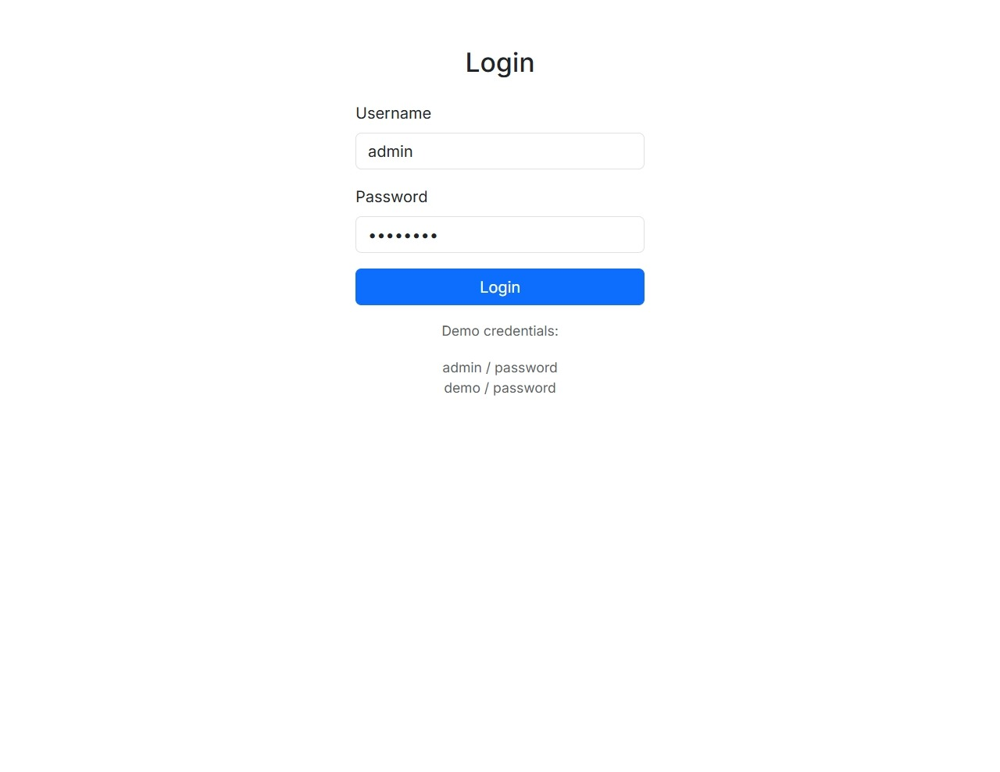
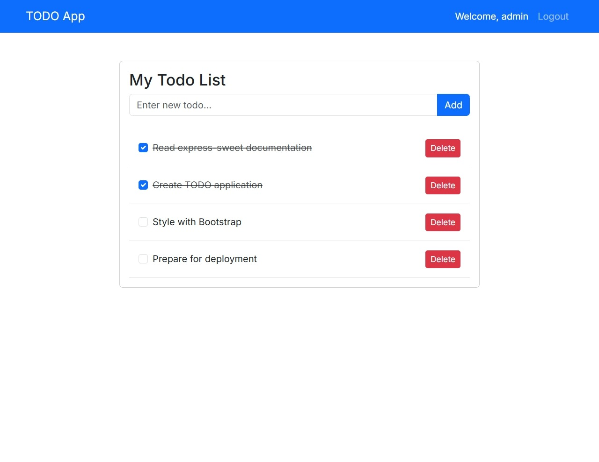
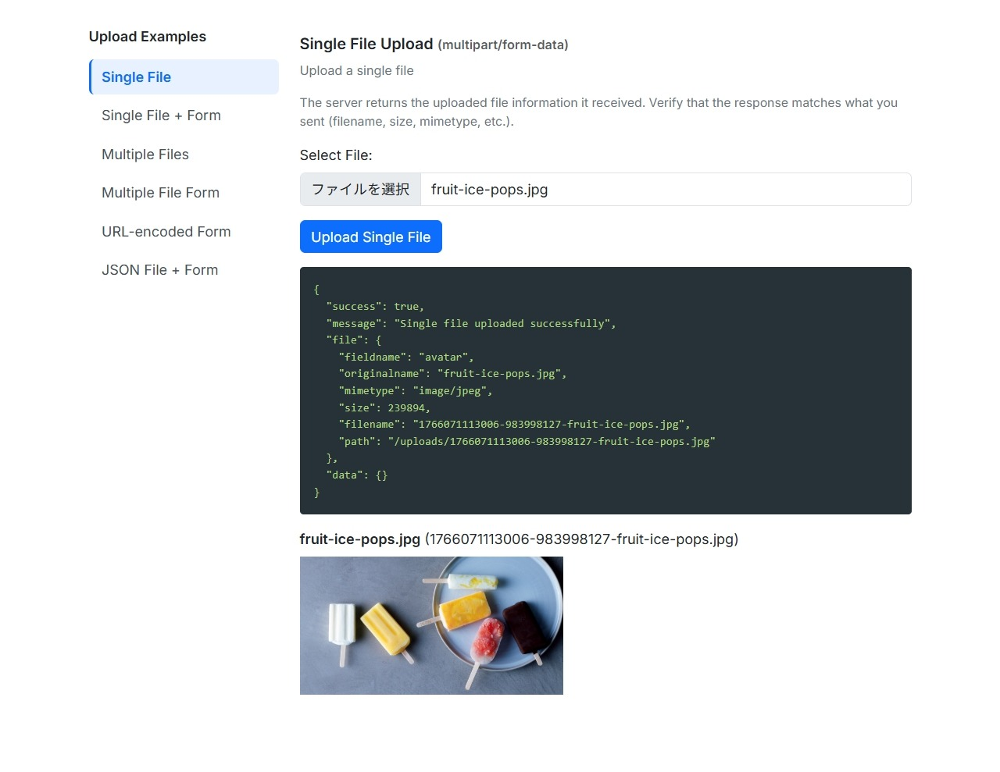

# EXPRESS SWEET Demos

This directory contains demonstration projects showcasing different use cases of EXPRESS SWEET.

## Available Demos

### 1. [REST API Demo](rest-api/)

Modern REST API with CORS support, demonstrating cross-origin requests and Bearer token authentication.

**Features:**
- CORS-enabled endpoints
- Bearer token authentication with Authorization header
- JSON-only responses
- Cache control with ETags and conditional requests
- Client-side example code for cross-origin requests

**Use this demo if you're building:**
- REST APIs consumed by SPAs (React, Vue, Angular)
- Mobile app backends
- Microservices with JSON APIs
- APIs with cross-origin access requirements

### 2. [TODO Demo](todo/)

Full-stack TODO application with authentication, database integration, and async operations.

**Features:**
- User authentication with Passport.js
- Database integration with Sequelize ORM
- RESTful API with fetch-based async operations
- Bootstrap 5 UI with no page reloads
- Session management

**Use this demo if you're building:**
- Full-stack web applications with user authentication
- Apps requiring database integration
- Single-page feel with server-side rendering
- Applications with CRUD operations

### 3. [File Upload Demo](multer-upload/)

File upload handling with Multer middleware integration.

**Features:**
- Dynamic upload middleware configuration
- Single and multiple file uploads
- Memory and disk storage options
- Route-based upload handling

**Use this demo if you're building:**
- Applications with file upload functionality
- Image/document management systems
- APIs that accept multipart form data
