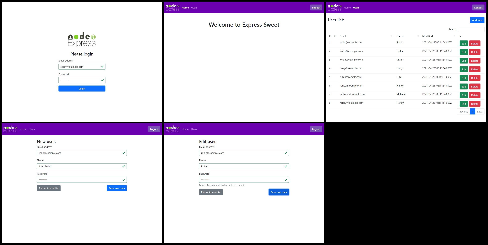

# express-sweet-example

This is an example of an Express Sweet application.  
This example application contains the following screens.

- Login screen
- Home Screen
- User list screen
- User addition screen
- User edit screen



## Prerequisites

Make sure you have installed all of the following prerequisites on your development machine.

* Git - [Download & Install Git](https://git-scm.com/downloads).
* Node.js - [Download & Install Node.js](https://nodejs.org/en/download/).
* Nginx - [Download & Install Nginx](https://www.nginx.com/resources/wiki/start/topics/tutorials/install/).
* PM2 - [Download & Install PM2](https://pm2.keymetrics.io/docs/usage/quick-start/).

## Running

Set up Nginx.
A sample Nginx config can be found in [nginx.sample.conf](./nginx.sample.conf).  
Please copy and use.

Create the DB used by this example.  
```sql
CREATE DATABASE IF NOT EXISTS `example` DEFAULT CHARACTER SET utf8mb4;

USE `example`;

CREATE TABLE `user` (
  `id` int(10) unsigned NOT NULL AUTO_INCREMENT,
  `email` varchar(255) NOT NULL,
  `password` varchar(100) NOT NULL,
  `name` varchar(30) NOT NULL,
  `created` datetime NOT NULL DEFAULT current_timestamp(),
  `modified` datetime NOT NULL DEFAULT current_timestamp() ON UPDATE current_timestamp(),
  PRIMARY KEY (`id`),
  UNIQUE KEY `ukAccount1` (`email`)
) ENGINE=InnoDB DEFAULT CHARSET=utf8mb4;

INSERT INTO `user` (`email`, `password`, `name`) VALUES
  ('robin@example.com', 'password', 'Robin'),
  ('taylor@example.com', 'password', 'Taylor'),
  ('vivian@example.com', 'password', 'Vivian'),
  ('harry@example.com', 'password', 'Harry'),
  ('eliza@example.com', 'password', 'Eliza'),
  ('nancy@example.com', 'password', 'Nancy'),
  ('melinda@example.com', 'password', 'Melinda'),
  ('harley@example.com', 'password', 'Harley');
```

Install example dependencies.
```sh
npm install;
```

Run the server.
```sh
npm start;
```

Open https://&lt;your host name&gt; page in your browser.

## License

[MIT licensed](./LICENSE.txt)